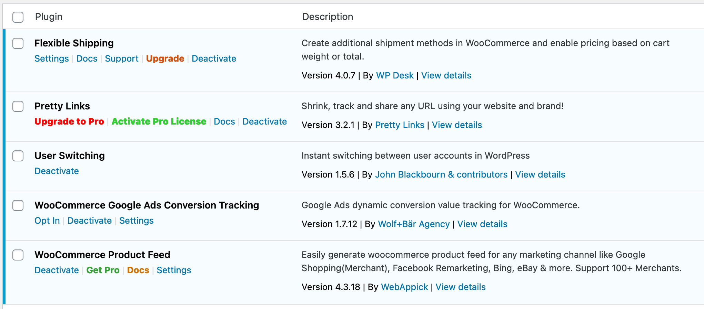
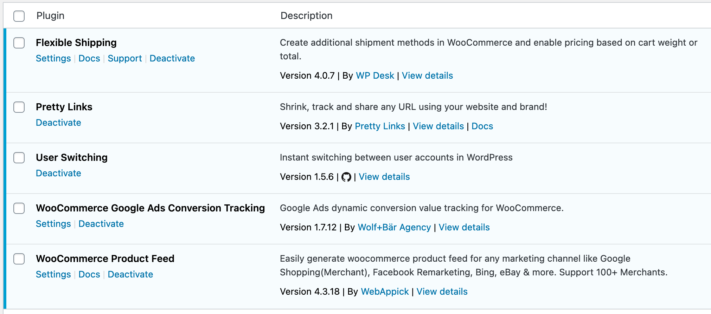
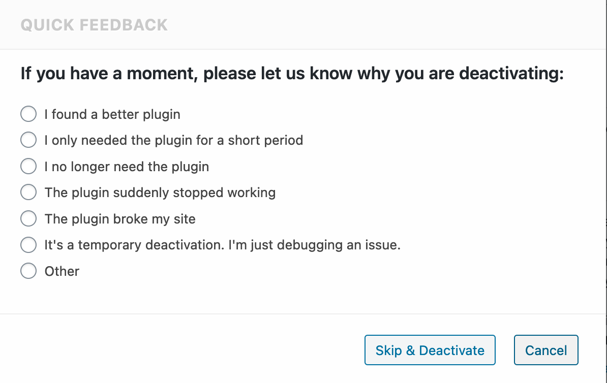

   

# Plugins Page Cleanup

Cleans up WordPress's plugins.php.

## Description

* Removes formatting from links
* Allows renaming plugin titles
* Prevents redirecting away from plugins.php on plugin activation
* Moves external links from the action links (first) column into the description column, and vice-versa
* Moves deactivate to the end of the list of action links, and settings to the beginning (where it exists)
* Replaces GitHub links with icons
* Removes click handlers on Deactivate links (to remove deactivation surveys)

Before:

After:

Rename plugins:

Removes JavaScript hooked to deactivation buttons to prevent these:

## Installation

[Download the latest release](https://github.com/BrianHenryIE/bh-wp-plugins-page/releases).

## TODO:

* ~~Set a max-length on plugin titles (line-break) so the description column isn't too cramped.~~ Added renaming.
* When removing a Licence link, add an admin notice for a few days so users can still easily access the page.
* Add a UI for adding Settings links for plugins that don't have them
* Add installed date and last updated date on each plugin
* Logs should go before Deactivate, never ahead of anything else.
* Reconsider use of PHP_INT_MAX in actions.

### More Information

See [github.com/BrianHenryIE/WordPress-Plugin-Boilerplate](https://github.com/BrianHenryIE/WordPress-Plugin-Boilerplate) for initial setup rationale. 

# Acknowledgements

I was finally promoted to write this after seeing someone (Timbr) complain about this same irritating problem on Discord.