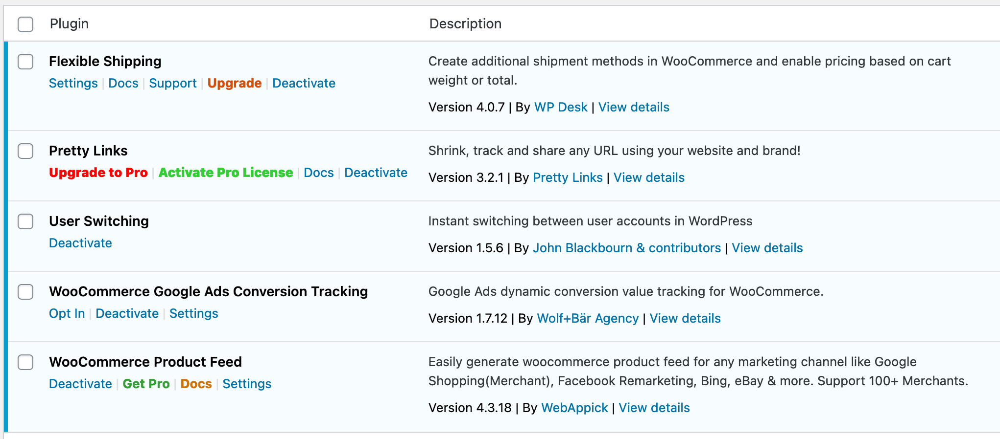
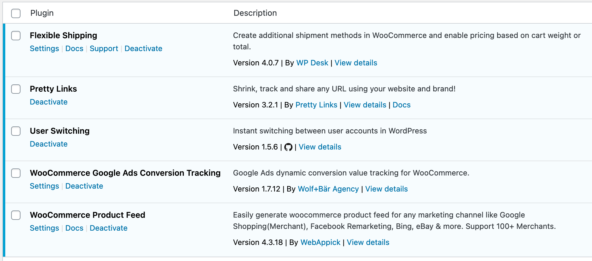
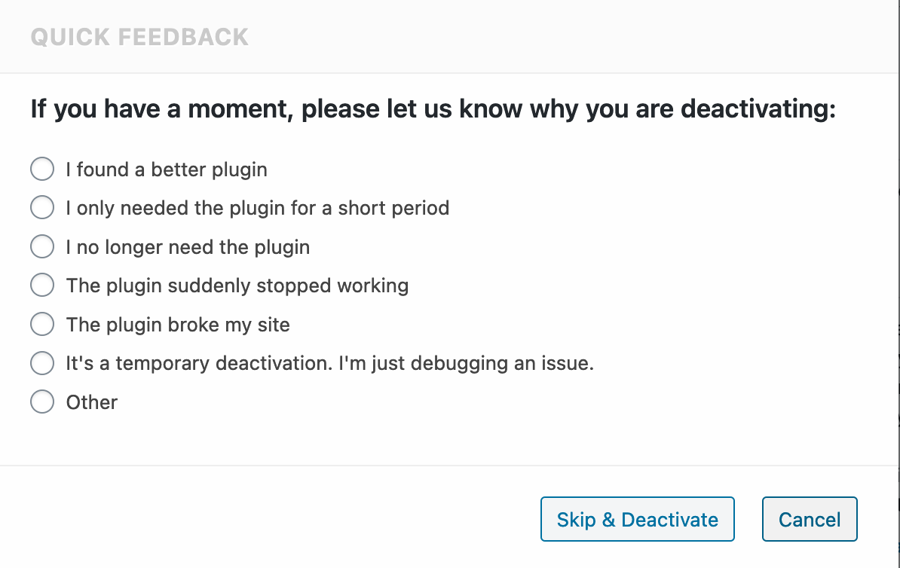

[](https://wordpress.org/plugins/bh-wp-plugins-page) [](https://github.com/WordPress-Coding-Standards/WordPress-Coding-Standards) [](https://brianhenryie.github.io/plugin_slug/)

# BH WP Plugins Page

Cleans up WordPress's plugins.php.

## Description

* Removes formatting from links on plugins.php
* Moves external links from the action links (first) column into the description column
* Moves deactivate to the end of the list of action links, and settings to the beginning (where it exists)
* Replaces GitHub links with icons
* Removes click handlers on Deactivate links (to remove deactivation surveys)



Before.


After


Removes JavaScript hooked to deactivation buttons.

## Installation

[Download the latest release](https://github.com/BrianHenryIE/bh-wp-plugins-page/releases).

## TODO:

* Set a max-length on plugin titles (line-break) so the description column isn't too cramped.
* When removing a Licence link, add an admin notice for a few days so users can still easily access the page.
* Add a UI for specifying Settings links for plugins that don't have them
* Add installed date and last updated date on each plugin

## Contributing

Open an issue with a link to a plugin that still needs something addressed. 


### Development

Clone this repo, open PhpStorm, then run `composer install` to install the dependencies.

```
git clone https://github.com/brianhenryie/bh-wp-plugins-page.git;
open -a PhpStorm ./;
composer install;
```

For integration and acceptance tests, a local webserver must be running with `localhost:8080/bh-wp-plugins-page/` pointing at the root of the repo. MySQL must also be running locally – with two databases set up with:

```
mysql_username="root"
mysql_password="secret"

# export PATH=${PATH}:/usr/local/mysql/bin

# Make .env available to bash.
export $(grep -v '^#' .env.testing | xargs)

# Create the databases.
mysql -u $mysql_username -p$mysql_password -e "CREATE USER '"$TEST_DB_USER"'@'%' IDENTIFIED WITH mysql_native_password BY '"$TEST_DB_PASSWORD"';";
mysql -u $mysql_username -p$mysql_password -e "CREATE DATABASE "$TEST_SITE_DB_NAME"; USE "$TEST_SITE_DB_NAME"; GRANT ALL PRIVILEGES ON "$TEST_SITE_DB_NAME".* TO '"$TEST_DB_USER"'@'%';";
mysql -u $mysql_username -p$mysql_password -e "CREATE DATABASE "$TEST_DB_NAME"; USE "$TEST_DB_NAME"; GRANT ALL PRIVILEGES ON "$TEST_DB_NAME".* TO '"$TEST_DB_USER"'@'%';";
```

### WordPress Coding Standards

See documentation on [WordPress.org](https://make.wordpress.org/core/handbook/best-practices/coding-standards/) and [GitHub.com](https://github.com/WordPress/WordPress-Coding-Standards).

Correct errors where possible and list the remaining with:

```
vendor/bin/phpcbf; vendor/bin/phpcs
```

### Tests

Tests use the [Codeception](https://codeception.com/) add-on [WP-Browser](https://github.com/lucatume/wp-browser) and include vanilla PHPUnit tests with [WP_Mock](https://github.com/10up/wp_mock). 

Run tests with:

```
vendor/bin/codecept run unit;
vendor/bin/codecept run wpunit;
vendor/bin/codecept run integration;
vendor/bin/codecept run acceptance;
```

Output and merge code coverage with:

```
composer run-script coverage-tests
```

To save changes made to the acceptance database:

```
export $(grep -v '^#' .env.testing | xargs)
mysqldump -u $TEST_SITE_DB_USER -p$TEST_SITE_DB_PASSWORD $TEST_SITE_DB_NAME > tests/_data/dump.sql
```

To clear Codeception cache after moving/removing test files:

```
vendor/bin/codecept clean
```

To create an installable zip `bh-wp-plugins-page-1.0.0.zip` from the `src` directory run:

`composer run-script create-plugin-archive`

### More Information

See [github.com/BrianHenryIE/WordPress-Plugin-Boilerplate](https://github.com/BrianHenryIE/WordPress-Plugin-Boilerplate) for initial setup rationale. 

# Acknowledgements

I was finally promoted to write this after seeing someone (Timbr) complain about this same irritating problem on Discord.